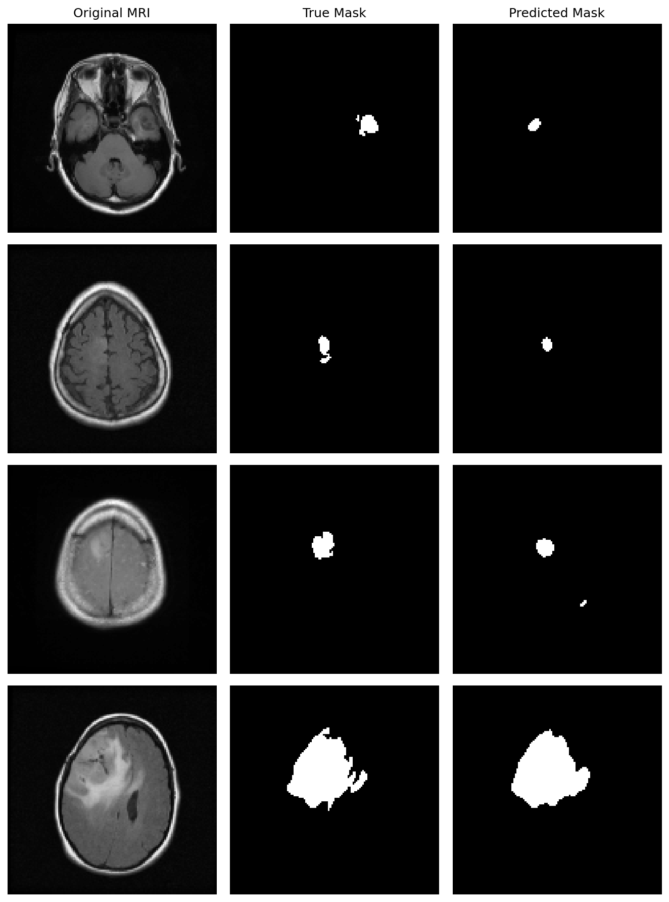

# Brain Tumor Segmentation — U-Net — Brain MRI

A deep learning model that looks at a brain MRI scan and tries to outline
where a tumor is, pixel by pixel.

**Result: Dice score of [TBD — add final test Dice here] on scans the model had never seen before.**

---

## What is image segmentation?

Most people have heard of image *classification* — a model looks at a photo
and says "this is a cat." Segmentation goes further: instead of labelling
the whole image, it labels **every single pixel**.

So for a brain MRI, the model doesn't just answer "is there a tumor?" It
answers "which exact pixels *are* the tumor?" The output is a mask — a
black-and-white image where white marks tumor and black marks everything
else.

Think of it as the difference between saying "there's a tumor in this scan"
and drawing a precise outline around it with a marker.

## Why build this?

Radiologists currently outline tumors by hand, slice by slice. A single
patient's MRI can have dozens of slices, and each one takes time and
concentration. It's slow, and two doctors can draw slightly different
boundaries.

An automated model can:
- Outline tumors in seconds instead of minutes
- Give consistent boundaries every time
- Measure tumor size and track whether it grows or shrinks between scans

This isn't meant to replace a doctor — it's meant to give them a starting
point they can adjust, so they spend their time on judgement instead of
tracing.

## The dataset

[LGG MRI Segmentation](https://www.kaggle.com/datasets/mateuszbuda/lgg-mri-segmentation)
— brain MRI scans from real patients, each paired with a mask that doctors
drew by hand showing the true tumor location.

Those hand-drawn masks are the "answer key." The model learns by comparing
its guesses against them, over and over, until its outlines match.

The full set has 3,929 slices, of which about 1,373 (35%) contain a tumor.
That imbalance matters a lot — see below.

## How U-Net works

U-Net is the model architecture. Its name comes from its shape — it goes
down, then back up, like the letter U.

**Going down (the encoder):** the image is compressed step by step. The
model loses fine detail but learns *what* it's looking at — edges, textures,
shapes that look like tumor tissue.

**Going up (the decoder):** the compressed understanding is expanded back to
full size, so the model can say *where* the tumor is and draw the mask.

**The shortcuts (skip connections):** fine detail lost on the way down is
passed directly across to the way up, which is why U-Net can draw sharper
outlines than a plain encoder-decoder network, and why it's the standard
choice for medical imaging.

## Current setup

| Component | Choice |
|---|---|
| Model | U-Net (2,066,497 parameters) |
| Input | 128×128 grayscale MRI slices |
| Output | Binary tumor mask |
| Loss | Binary cross-entropy |
| Optimizer | Adam (default learning rate) |
| Training | [TBD — confirm final epoch count], batch size 16, on the full dataset (tumor + non-tumor slices) |
| Framework | TensorFlow / Keras |

## Where things stand right now

Early runs show accuracy sitting around 98–99%, but Dice is still low
(in the 0.1–0.2 range as of the last run). This is expected, not a bug —
accuracy is misleading here:

Across the whole dataset, roughly 1% of all pixels are tumor. A model that
predicts "no tumor" everywhere would still score around 99% accuracy while
being completely useless. **Dice score** measures actual overlap between
the predicted mask and the true mask — 1.0 is a perfect match, 0.0 is no
overlap at all — so it's the metric that actually tells us whether the
model found the tumor or not.

**Next steps to improve the Dice score** (based on comparing against a
similar project):
1. Switch the loss function from plain BCE to a combined BCE + Dice loss,
   so the model is directly penalized for missing the tumor region
2. Consider training only on slices that actually contain a tumor, since
   feeding it mostly-empty images may be drowning out the signal
3. Try a lower learning rate if the model appears to jump to a "predict
   nothing" answer early in training
4. Train for more epochs — 5 is likely not enough for Dice to fully climb

## Results

### Training curves

*(TBD — copy the saved `training_curves.png` from the project folder into
this results folder)*

### Predicted masks

*(TBD — copy the saved prediction image(s) from the project folder)*

### Tumor overlay

*(TBD — copy the saved overlay image(s) from the project folder)*

## Results summary

| Metric | Score |
|---|---|
| Test Dice | [TBD] |
| Train Dice (final epoch) | [TBD] |
| Validation Dice (final epoch) | [TBD] |
| Test accuracy | [TBD] (not very meaningful — see above) |

## How to run

1. Download the [LGG MRI Segmentation dataset](https://www.kaggle.com/datasets/mateuszbuda/lgg-mri-segmentation)
2. Update the `DATA_DIR` path in the script to point at the unzipped
   `kaggle_3m` folder
3. Install dependencies: `opencv-python`, `numpy`, `scikit-learn`,
   `matplotlib`, `tensorflow`
4. Run the script

## Tech stack

Python · TensorFlow/Keras · OpenCV · NumPy · scikit-learn · Matplotlib

## Limitations (current state)

- Trained on the full dataset including tumor-free slices, which likely
  makes it harder for the model to learn the tumor signal
- Uses plain binary cross-entropy loss rather than a Dice-aware loss
- Only trained for a small number of epochs so far — Dice was still
  climbing when training stopped
- Uses grayscale input; the original scans have channels that could carry
  extra useful information
- Trained on one dataset from one source, so it may not transfer to scans
  from different machines or hospitals
